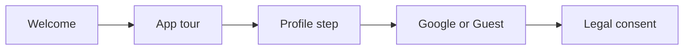
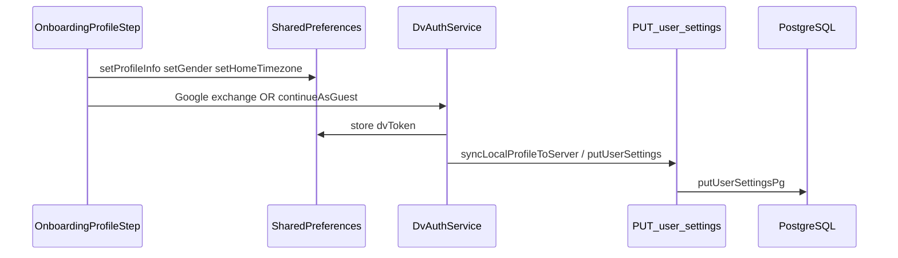

# Onboarding redesign: profile, app tour, and server sync

## Current state

- [lib/screens/onboarding/onboarding_screen.dart](lib/screens/onboarding/onboarding_screen.dart): welcome, generic slides, auth. **No profile step.** Completion → `markOnboardingCompleted` → [LegalConsentScreen](lib/screens/legal_consent_screen.dart) ([main.dart](lib/main.dart)).
- Profile APIs: [DvAuthService.setProfileInfo](lib/services/dv_auth_service.dart) (name, weight, height, DOB, activity, diet, allergies) + gender / timezone helpers. Full UI: [profile_completion_screen.dart](lib/screens/auth/profile_completion_screen.dart) (from Account in [auth_gateway_screen.dart](lib/screens/auth/auth_gateway_screen.dart)).
- **Server:** [putUserSettings](lib/services/dv_auth_service.dart) sends `PUT /user/settings` with Bearer `dvToken`; **no-ops without token** (early return). Backend [server.js](backend/src/server.js) `PUT /user/settings` → [putUserSettingsPg](backend/src/sync_pg.js) persists **gender, display_name, weight_kg, height_cm, date_of_birth, home_timezone**, subscription fields—not activity/diet/allergies (client sends them; route ignores).
- Settings replay: [OnboardingScreen(replayMode: true)](lib/screens/settings_menu_screen.dart) with Skip on auth.

## Target user journey

1. **Welcome** — Brand + Sprouty; calm copy per [.cursorrules](.cursorrules) / [brand.mdc](.cursor/rules/brand.mdc).
2. **Tour (3–4 slides)** — Match real product: Home dashboard, Habits, Presets, Journal (optional mood/vision). All titles/body use [AppTypography](lib/utils/app_typography.dart); spacing uses [AppSpacing](lib/utils/app_spacing.dart) (or equivalent 4pt multiples only); assets under `assets/onboarding/`.
3. **Profile** — Minimal friction: **display name** required (or explicit Skip policy—pick one). Optional avatar, gender, DOB, units via existing services. **On Next:** `setProfileInfo` + `setGender` / `setProfilePicPath` / `setHomeTimezone` as needed so data survives crashes **before** any token exists.
4. **Auth** — Existing Google + Guest + exchange. Pre-fill name from `FirebaseAuth.instance.currentUser?.displayName` if empty.
5. **Post-auth server sync** — Immediately after `exchangeFirebaseIdTokenForDvToken` or `continueAsGuest` succeeds, call **`syncLocalProfileToServer()`** so prefs flow to DB (best-effort; failures must not block onboarding).

## Design system compliance (non-negotiable)

Onboarding must **not** introduce one-off fonts, arbitrary pixel spacing, or colors outside the established tokens. Treat [.cursorrules](.cursorrules) and [.cursor/rules/design-consistency.mdc](.cursor/rules/design-consistency.mdc) as the checklist for every new/changed widget.

| Concern | Rule |
|--------|------|
| **Typography** | Use `AppTypography.*(context)` only—`heading1`–`heading3`, `body`, `bodySmall`, `caption`, `button`, `secondary`, `error`. No ad-hoc `TextStyle(fontSize: …)` or manual `fontFamily`. Minimum visible text **12sp** (`caption`). |
| **Spacing** | Prefer `AppSpacing.xs`–`xxl` for padding, gaps, and `SizedBox` heights. All values must sit on the **4pt grid** (no 7, 15, 22, etc.). |
| **Color** | Prefer `Theme.of(context).colorScheme` for core UI; use [AppColors](lib/utils/app_colors.dart) for approved fixed tokens (`skyDecoration`, `cloudDecoration`, `forestDeep` nav pattern, `honeyText` for reward-style copy, etc.). No raw `Color(0xFF…)`. |
| **Radii** | Use system radii: inputs/buttons **12** (`AppSpacing.radiusInput`), cards **24** (`radiusCard`), chips **8**, dialogs **20**—per .cursorrules. |
| **Surfaces** | Scaffold body: `AppColors.skyDecoration(isDark: …)`; cards: `AppColors.cloudDecoration` or `GlassCard` where appropriate—same two-surface rule as other screens. |
| **Touch targets** | Interactive controls **≥ 48×48**; wrap tight icons in padded hit areas or `IconButton` with minimum size. |
| **Motion** | Durations limited to 100 / 200 / 300 / 500 ms; standard curves only—per .cursorrules §11. |
| **UX tone** | Copy and empty states follow [brand.mdc](.cursor/rules/brand.mdc) (calm, growth-oriented; no loud/gamified stress). |
| **Accessibility** | `Semantics` on custom controls; validate at larger text scale where layouts allow. |

When extracting or sharing widgets with [profile_completion_screen.dart](lib/screens/auth/profile_completion_screen.dart), **align onboarding fields to the same typography and spacing patterns** as that screen (or refactor both to shared building blocks) so the profile step feels like the rest of the app, not a separate skin.

## Data: local vs database

| Fields | Local (prefs) | PostgreSQL today |
|--------|-----------------|------------------|
| Display name, weight, height, DOB, gender, timezone | Yes | Yes |
| Activity, diet, allergies | Yes | No (optional future migration) |

## Implementation

| Area | Action |
|------|--------|
| **Sync helper** | Add `DvAuthService.syncLocalProfileToServer()`: if no `dvToken`, return; else read getters (`getDisplayName`, `getWeightKg`, `getHeightCm`, `getDateOfBirth`, `getGender`, `getHomeTimezone`, etc.) and call `putUserSettings` (include activity/diet/allergies in JSON for forward compatibility). |
| **Onboarding** | Wire profile Next → prefs only. Auth success path → `await syncLocalProfileToServer()` (or `unawaited` if you want zero spinner—product choice; still fire the request). |
| **Profile completion screen** | Reuse same helper after save if token exists (avoid drift). |
| **Slide model** | Extend `_SlideType` or use `List<OnboardingPage>`; single `PageController`. |
| **Profile UI** | Prefer `lib/screens/onboarding/widgets/onboarding_profile_step.dart` sharing validation + `DvAuthService` with profile screen (extract shared chunk rather than duplicate 700+ lines). |
| **Theme / layout** | See **Design system compliance** above; inputs follow the shared `InputDecoration` pattern (filled, `radiusInput`, `colorScheme` borders/focus). Bottom bar Next/Back matches button patterns from .cursorrules §8a. |
| **Mascot** | Optional on profile slide; if editing painter, use `AppColors.sproutGreen` / `forestDeep` (no legacy neon). |
| **Copy** | Const list or [labels.json](lib/utils/labels.json) for later i18n. |
| **Replay** | Skip behavior consistent with today; confirm whether replay should alter `onboarding_completed` semantics. |

## Files likely touched

- [lib/screens/onboarding/onboarding_screen.dart](lib/screens/onboarding/onboarding_screen.dart)
- New: `lib/screens/onboarding/widgets/onboarding_profile_step.dart` (or similar)
- [lib/services/dv_auth_service.dart](lib/services/dv_auth_service.dart) — `syncLocalProfileToServer`
- Optionally [lib/screens/auth/profile_completion_screen.dart](lib/screens/auth/profile_completion_screen.dart) — shared form extraction
- Optional backlog: [backend/src/server.js](backend/src/server.js), [backend/src/sync_pg.js](backend/src/sync_pg.js), new migration for extra columns

## Testing / QA

- Fresh install: tour → profile save → guest → legal → dashboard; `getDisplayName()` matches; with DB, optional `GET /user/settings` sanity check.
- Google path: token exchange then sync; name merge.
- No DB / 501 / offline: onboarding still completes.
- Settings replay: Skip exits cleanly.
- Visual pass: onboarding screens at default and ~200% text scale; confirm spacing stays on-grid and no clipped labels.

## Scope

**In scope:** UX flow, Flutter structure, local persistence, post-auth best-effort DB sync, and **full parity** with app-wide typography, spacing, color, and component rules.

**Out of scope (unless optional-db-extend):** Storing activity/diet/allergies in Postgres; heavy illustration/motion pass (can layer on same slide list).

---

_Supersedes the separate plans “Onboarding profile + tour” and “Profile local + DB sync”._
